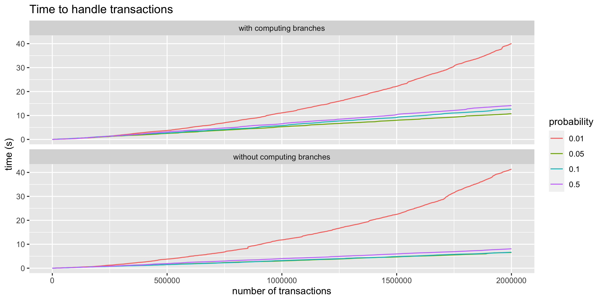
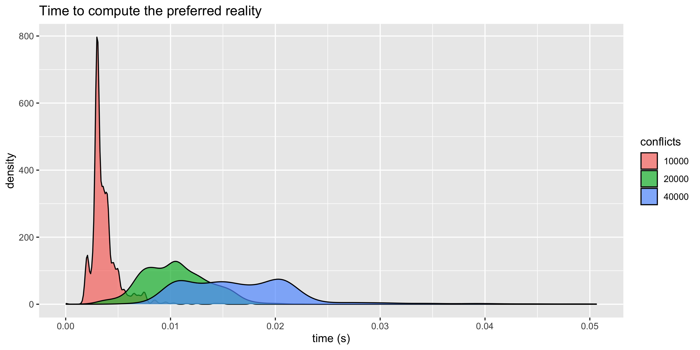
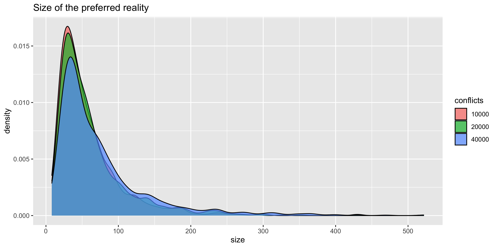
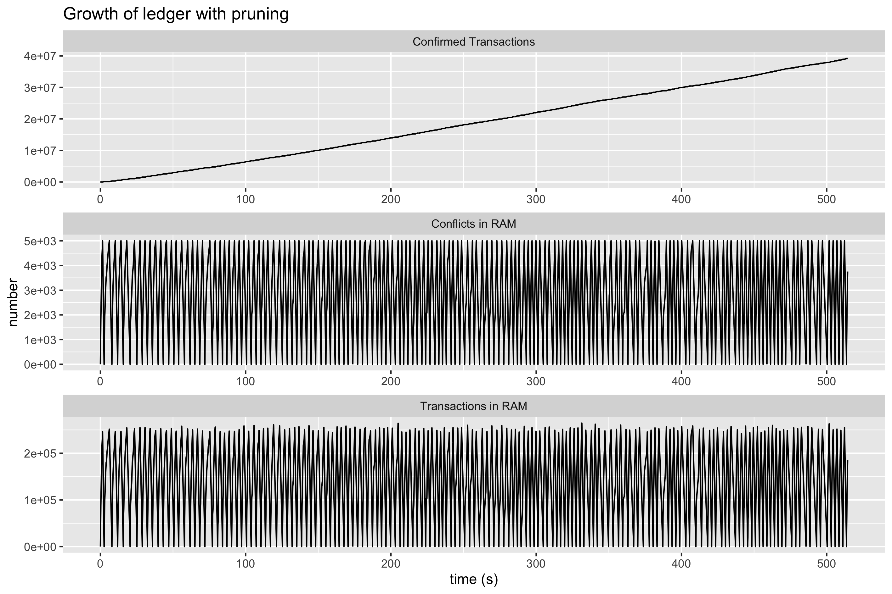

# Reality-based UTXO Ledger

This repository is dedicated to building a reality-based ledger using the Unspent Transaction Output (UTXO) model. This initiative is supported by the paper [Reality-based UTXO ledger](https://arxiv.org/abs/2205.01345), which can be found in the repository named `Reality_based_UTXO_ledger.pdf`. See Section 6 `"Numerical Experiments"` for details about experiments.

We have set up four tests to explore various functionalities of the reality-based UTXO ledger.

## Table of Contents

- [Reality-based UTXO Ledger](#reality-based-utxo-ledger)
  - [Table of Contents](#table-of-contents)
  - [Construct Ledger (Test)](#construct-ledger-test)
    - [Prerequisites: Go 1.20](#prerequisites-go-120)
  - [Compute Reality (Test)](#compute-reality-test)
  - [Generate Ledger, Find Reality, Confirm and Prune Transactions (Test)](#generate-ledger-find-reality-confirm-and-prune-transactions-test)
  - [Visualisation](#visualisation)
    - [Prerequisites: Software R](#prerequisites-software-r)
    - [Running the Program](#running-the-program)
  - [Draw Ledger (Test)](#draw-ledger-test)
    - [Prerequisite: Graphviz's `dot` Command-Line Tool](#prerequisite-graphvizs-dot-command-line-tool)
      - [Installation Instructions](#installation-instructions)
    - [Using `dot` to Convert DOT Files to SVG](#using-dot-to-convert-dot-files-to-svg)
---

## Construct Ledger (Test)

You can compute the time needed to construct a reality-based ledger based on a stream of generated transactions by running the test `go test -run TestTimeLedgerGrow`.

The procedure followed by this test involves:

1. Generating a stream of transactions until the ledger hits a pre-defined number of transactions (`numTransactions := 2000000`). The conflicts are generated with `probabilityConflict := []float64{0.01, 0.05, 0.1, 0.5}`. 

2. Measuring the time for all operations involved in this process, except creating random transactions. The resulting timestamps, number of conflicts, and transactions are recorded in `ledgerGrow.txt`.

3. The data contained in `ledgerGrow.txt` can be used with `visualisation.R` to create a graphic: 

> **Note:** Creating random transactions, particularly checking property 4 of Assumption 4.1 in [Reality-based UTXO ledger](https://arxiv.org/abs/2205.01345), takes up most of the test execution time.

### Prerequisites: Go 1.20
To run this program, you will need to have Go (version 1.20 or higher) installed on your machine. You can download the latest version of Go from the official [Go Downloads page](https://golang.org/dl/).

You also need to have the following libraries installed:

- github.com/dominikbraun/graph v0.22.0
- github.com/woodywood117/stopwatch v0.1.1
- golang.org/x/exp v0.0.0-20230522175609-2e198f4a06a1

To install these libraries, use the `go get` command:

```bash
go get github.com/dominikbraun/graph@v0.22.0
go get github.com/woodywood117/stopwatch@v0.1.1
go get golang.org/x/exp@v0.0.0-20230522175609-2e198f4a06a1
```
---

## Compute Reality (Test)

By running the test `go test -run TestTimeComputeReality`, you can compute the time needed to find the reality from the set of conflicts. 

This test essentially follows the steps:

1. Constructs a reality-based ledger with `probabilityConflict=0.1` until the ledger reaches a certain number of conflicts (`upBoundConflicts := []int{10000, 20000, 40000}`). Testing is carried out `numGetReality=10` times for each number of conflicts.

2. For the constructed set of random conflicts, the reality is computed and the time taken is measured.

3. The time for constructing the reality and its size are then recorded in `getRealityTime.txt`.

4. The data contained in `getRealityTime.txt` can be used with `visualisation.R` to create a graphics: 


> **Note:** Creating a random ledger with the required number of conflicts, especially checking property 4 of Assumption 4.1 in [Reality-based UTXO ledger](https://arxiv.org/abs/2205.01345), consumes most of the test execution time. For more detailed and accurate plots, we recommend setting the parameter `numGetReality` larger than `100`. However, this might lead to a longer execution time.

---

## Generate Ledger, Find Reality, Confirm and Prune Transactions (Test)

By running `go test -run TestTimeConfirmedTransactionLimitConflict`, you can generate a stream of transactions, which are confirmed or pruned once the number of conflicts exceeds a certain threshold.

The steps in this test include:

1. Generating a stream of transactions with `probabilityConflict=0.01` until the ledger reaches a certain number of conflicts (`upBoundConflicts := 5000`).  

2. Computing the reality for the constructed set of random conflicts,

 finding transactions consistent with the reality (considered confirmed), and pruning the remaining transactions. The unspent outputs of the confirmed transactions are used as outputs of a new genesis. This process repeats from step 1 until a total number of `numTransactions := 400000` transactions is generated.

3. Measuring the time for all operations in this process, except for creating transactions. The timestamps, the number of conflicts in RAM, transactions in RAM, and confirmed transactions for those timestamps are recorded in `ledgerGrowAndPrune.txt`.  

4.  The data contained in `ledgerGrowAndPrune.txt` can be used with `visualisation.R` to create a graphic: 

> **Note:** Most of the test execution time goes into creating random transactions, particularly in checking property 4 of Assumption 4.1 in [Reality-based UTXO ledger](https://arxiv.org/abs/2205.01345).

---

## Visualisation
The file `visualisation.R` is designed to visualize the data from the `getRealityTime.txt`, `ledgerGrow.txt`, and `ledgerGrowAndPrune.txt` files.

### Prerequisites: Software R
To run this program, you will need to have R installed on your machine along with the following libraries:

- ggplot2
- dplyr
- tidyr
- reshape2

You can install the required libraries in R using the following commands:

```R
install.packages("ggplot2")
install.packages("dplyr")
install.packages("tidyr")
install.packages("reshape2")
```

You also need to have the following data files in the same directory as the R program:

- getRealityTime.txt
- ledgerGrow.txt
- ledgerGrowAndPrune.txt

### Running the Program
1. Open RStudio or your preferred R environment.
2. Set your working directory to where your R script is located using `setwd("path/to/your/script")`.
3. Load the script using the `source("your_script_name.R")` command.

The program will create the following files:

- TimeToCompute.png
- SizeOfReality.png
- TimeToHandleTransactions.png
- LedgerGrowth.png

These PNG files contain graphs for visualizing the data from the input text files.


## Draw Ledger (Test)

You can generate a stream of `numTransactions := 16` transactions with `probabilityConflict := 0.4` by running `go test -run TestDrawLedger`.

This test follows the process:

1. Creates a `ledger_start.gv` file once these transactions are generated.
2. Computes the reality, finds confirmed conflicting transactions, and writes the ledger in `ledger_after_reality.gv`.
3. Prunes the rejected transactions from the ledger and creates the file `ledger_after_pruning.gv`.
4*. Please convert the `gv` files to `svg` files using the command `dot -Tsvg -O ledger_start.gv ledger_after_reality.gv ledger_after_pruning.gv` to see the evolution of the ledger after applying certain operations.


**Example:**
At the first step, we construct a ledger consisting of `16` transactions. Rectangles correspond to transactions, whereas ovals are the outputs of the transactions. Unspent outputs are not shown for simplicity. Recall that two transactions are conflicting or simply conflicts if they spent the same output. We use blue color for the genesis and red color fo highlighting conflicts.

<p align="center">

</p>

The following picture demonstrates the ledger after finding the reality.  We use blue color for the genesis and the confirmed conflicting transaction in the reality and red color for conflicts which are not in the constructed reality.

<p align="center">

</p>

The result after pruning rejected transactions, that are not consistent with the chosen reality, is depicted in the following picture. All transactions are considered as confirmed and depicted with blue color.

<p align="center">

</p>

### Prerequisite: Graphviz's `dot` Command-Line Tool

To visualize and convert Graphviz DOT files (`.gv`) to various formats, including SVG, you'll need to have Graphviz installed on your system. Graphviz is an open-source graph visualization software package. One of its command-line tools, `dot`, is used to render graphs and generate output in different formats.

#### Installation Instructions

To install Graphviz, follow these steps:

1. Visit the official Graphviz website: [https://www.graphviz.org/](https://www.graphviz.org/)
2. Download and install the appropriate version of Graphviz for your operating system.
3. Make sure to add the Graphviz binaries to your system's PATH environment variable, so you can access the `dot` command from anywhere in the command-line interface.

### Using `dot` to Convert DOT Files to SVG

Once you have Graphviz installed, you can use the `dot` command-line tool to convert Graphviz DOT files (`.gv`) to SVG format.

To convert a DOT file to SVG, open a terminal or command prompt and navigate to the directory containing the DOT file. Then run the following command:

```
dot -Tsvg -O input.gv
```

This command will generate an SVG file with the same name as the input DOT file, but with the `.svg` extension.

You can then open the SVG file in a web browser or any SVG-compatible viewer to visualize the graph.

---
